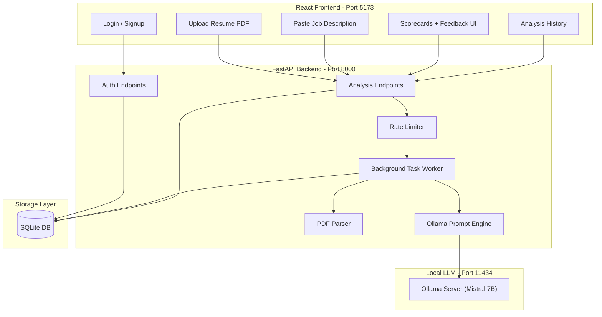

# AI Resume Job Matcher

An AI-powered web application that analyzes how well your resume matches a job description. Upload a PDF resume, paste a job description, and get an instant skill match score with actionable feedback — all powered by a **free, locally-running LLM** via Ollama.

## Architecture



## Tech Stack

| Layer      | Technology                        |
|------------|-----------------------------------|
| Backend    | Python, FastAPI, SQLAlchemy       |
| AI         | Ollama + Mistral 7B (local LLM)  |
| Database   | SQLite (async via aiosqlite)      |
| Frontend   | React, Vite, Tailwind CSS         |
| Auth       | JWT (python-jose + passlib)       |
| PDF Parse  | PyMuPDF                           |

## Prerequisites

- **Python 3.11+**
- **Node.js 18+**
- **Ollama** installed with the Mistral model

### Install Ollama

```bash
# macOS
brew install ollama

# Or download from https://ollama.com

# Pull the Mistral 7B model (~4.1GB download)
ollama pull mistral

# Start the Ollama server (if not already running)
ollama serve
```

## Setup

### 1. Backend

```bash
cd backend

# Create a virtual environment (recommended)
python -m venv venv
source venv/bin/activate  # On Windows: venv\Scripts\activate

# Install dependencies
pip install -r requirements.txt

# Copy environment config
cp .env.example .env
# Edit .env and set a real JWT_SECRET

# Start the server
uvicorn app.main:app --reload --port 8001
```

### 2. Frontend

```bash
cd frontend

# Install dependencies
npm install

# Start the dev server
npm run dev
```

The frontend runs on **http://localhost:5173** and the backend API on **http://localhost:8001**.

### 3. Ollama

Make sure Ollama is running with the Mistral model available:

```bash
ollama serve   # If not already running
ollama list    # Should show "mistral" in the list
```

## Environment Variables

Create `backend/.env` from `.env.example`:

| Variable            | Default                           | Description                        |
|---------------------|-----------------------------------|------------------------------------|
| `OLLAMA_BASE_URL`   | `http://localhost:11434`          | Ollama server URL                  |
| `OLLAMA_MODEL`      | `mistral`                         | Model name to use                  |
| `JWT_SECRET`        | `change-me-to-a-random-secret-key`| Secret key for signing JWT tokens  |
| `JWT_ALGORITHM`     | `HS256`                           | JWT signing algorithm              |
| `JWT_EXPIRE_MINUTES`| `60`                              | Token expiration time in minutes   |
| `DATABASE_URL`      | `sqlite+aiosqlite:///./app.db`    | SQLAlchemy async database URL      |

## API Endpoints

### Auth

#### Sign Up

```bash
curl -X POST http://localhost:8001/auth/signup \
  -H "Content-Type: application/json" \
  -d '{"email": "user@example.com", "password": "secret123"}'
```

Response:
```json
{
  "access_token": "eyJhbGciOiJIUzI1NiIs...",
  "token_type": "bearer"
}
```

#### Login

```bash
curl -X POST http://localhost:8001/auth/login \
  -H "Content-Type: application/json" \
  -d '{"email": "user@example.com", "password": "secret123"}'
```

### Analysis

#### Submit Analysis

```bash
curl -X POST http://localhost:8001/analysis/ \
  -H "Authorization: Bearer <your-token>" \
  -F "resume=@resume.pdf" \
  -F "job_description=We are looking for a Python developer with 3+ years of experience in FastAPI, PostgreSQL, and Docker..."
```

Response:
```json
{
  "id": "abc123-def456-...",
  "status": "pending"
}
```

#### Poll for Results

```bash
curl http://localhost:8001/analysis/abc123-def456-... \
  -H "Authorization: Bearer <your-token>"
```

Response (when completed):
```json
{
  "id": "abc123-def456-...",
  "status": "completed",
  "job_description": "We are looking for a Python developer...",
  "match_score": 72.5,
  "matched_skills": ["Python", "FastAPI", "SQL", "REST APIs"],
  "missing_skills": ["Docker", "Kubernetes", "CI/CD"],
  "suggestions": [
    "Add a dedicated 'DevOps' section highlighting any containerization experience",
    "Include specific metrics for your FastAPI projects (requests/sec, uptime)",
    "Mention any experience with Docker even in personal projects",
    "Add keywords from the job description like 'microservices' and 'cloud deployment'",
    "Consider adding a 'Technical Skills' summary section at the top of your resume"
  ],
  "error_message": null,
  "created_at": "2026-02-09T12:00:00Z",
  "completed_at": "2026-02-09T12:00:25Z"
}
```

#### List History

```bash
curl http://localhost:8001/analysis/ \
  -H "Authorization: Bearer <your-token>"
```

## How It Works

1. **User signs up / logs in** and receives a JWT token
2. **Uploads a PDF resume** + pastes a job description
3. **Backend extracts text** from the PDF using PyMuPDF
4. **Background task** sends the resume text + job description to Ollama (Mistral 7B)
5. **AI analyzes** the match and returns structured JSON with scores, skills, and suggestions
6. **Frontend polls** for the result and displays a beautiful scorecard

## Known Limitations

- **Scanned PDFs** are not supported — only text-based PDFs can be parsed. If your resume is a scanned image, convert it to a text-based PDF first.
- **Response time** depends on your hardware — Mistral 7B typically takes 10-30 seconds per analysis on a modern machine. Faster with GPU, slower on CPU-only.
- **Memory requirements** — Mistral 7B needs approximately 4-8GB RAM. Ensure your machine has sufficient memory.
- **JSON parsing** — the LLM occasionally returns malformed JSON. The app includes retry logic (up to 3 attempts) and fallback parsing to handle this.
- **Skill extraction accuracy** depends on how clearly the resume and job description are written. Well-structured documents yield better results.
- **Rate limits** — 10 analyses per hour per user, 30 auth requests per minute per IP.
- **No real-time updates** — the frontend polls every 2 seconds for results (no WebSocket support).
- **Single model** — currently hardcoded to Mistral via Ollama. Can be changed via the `OLLAMA_MODEL` environment variable to any model Ollama supports.

## License

MIT
